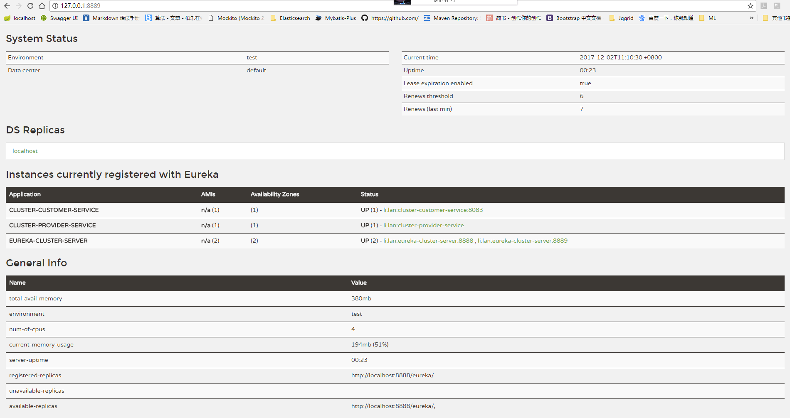
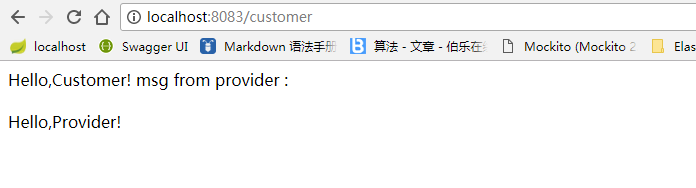

##集群启动步骤

###启动eureka服务端
1. 先将application-cluster8888.yml内容覆盖application.yml
1. 运行EurekaServerApplication
1. 将application-cluster8889.yml里面的内容覆盖application.yml
1. 运行EurekaServerApplication

*springboot自动加载application.yml配置文件 不会自动加载application-cluster8889.yml*
###启动服务提供者 进行服务注册
运行springcloud-eureka-cluster-client-provider模块的ProviderApplication

###启动服务提供者消费者
运行springcloud-eureka-cluster-client-customer模块的CustomerApplication

----------------------------------------------
####效果

消费服务
